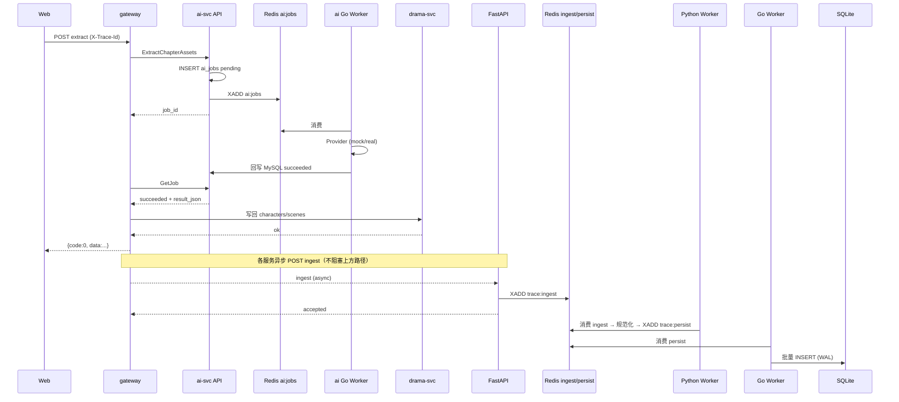

# AIDramastic 系统设计摘要（DESIGN）

| 字段 | 内容 |
|------|------|
| 文档版本 | v0.3 |
| 日期 | 2026-09-27 |
| 状态 | 现行 |
| 关联 | `PRD.md` / `BACKGROUND.md` / `CODING_STANDARDS.md`；`AGENTS.md`；`traceService/docs/` |

> 摘要级设计；traceService 细节以 `traceService/docs/DESIGN.md`、`ARCHITECTURE.md` 为准。

---

## 1. 背景摘要

MVP 要跑通「多 Go 微服务 + Vue3 + 可插拔 AI mock + Redis 队列 Worker + 轻量可观测」。

- **漫剧 ai-svc**：API 入队 + **Go Worker** 消费（Redis Stream `ai:jobs`）；禁止 handler 同步调 Provider（mock 也走 Worker）。
- **traceService** 定死：**FastAPI API + Python Worker + Go Worker + Redis + SQLite**（两级队列 `trace:ingest` → `trace:persist`）。

主业务上报日志必须 **异步、短超时、失败可丢**，绝不阻塞用户请求路径。队列总则见 `AGENTS.md` §K。

---

## 1.1 存储分层（写死）

| 系统 | 持久化主库 | Redis | 禁止 |
|------|------------|-------|------|
| 漫剧主系统 | **MySQL** | **队列**（`ai:jobs`）、JWT 黑名单、热点缓存；非业务主库 | 业务表用 SQLite；用进程内 goroutine 替代默认队列 |
| traceService | **SQLite** | 两级队列 `trace:ingest` / `trace:persist` + 查询缓存 | MVP 将 trace 主库改为 MySQL |

权威条目：仓库根 `AGENTS.md` §J（存储）/ §K（队列与 Worker）。

### 1.2 队列与存储并列（写死）

| 域 | 持久化 | 队列 | Worker |
|----|--------|------|--------|
| ai-svc | MySQL `ai_jobs` | Redis Stream `ai:jobs` | Go Worker（`cmd/worker`） |
| trace | SQLite | `trace:ingest` → `trace:persist` | Python Worker + Go Worker |

---

## 2. 服务边界

```
┌──────────── web (Vue3) ────────────┐
│  Authorization + X-Trace-Id        │
└───────────────┬────────────────────┘
                │ HTTP JSON
                ▼
┌──────────── gateway ───────────────┐
│  JWT / 错误体 / 透传 metadata       │
└───┬──────────┬──────────┬──────────┘
    │ gRPC     │ gRPC     │ gRPC
    ▼          ▼          ▼
 user-svc   drama-svc   ai-svc
    │          │          │
    └──────────┴──────────┘
                │ 异步 fire-and-forget（短超时）
                ▼
        POST /api/v1/logs/ingest
                │
         traceService（见 §6）
```

| 服务 | 职责 | 禁止 |
|------|------|------|
| gateway | HTTP BFF、JWT、聚合 | 落业务库 |
| user-svc | 账号/JWT 黑名单 | 调外部 AI |
| drama-svc | 内容元数据 CRUD | 直调外部 AI |
| ai-svc | API 建 job/入队/查状态；Go Worker 跑 Provider | 反向依赖 drama（MVP）；API 同步调 Provider |
| web | 主业务 UI | 直连 gRPC |
| traceService | 日志 ingest/查询/Web | 被主仓 import |

---

## 3. 关键序列（抽取资产）



ASCII 简版：

```
Web → gateway → ai-svc API (enqueue) → Redis ai:jobs → ai Go Worker → MySQL
                      │
                      └─ GetJob → drama 写回 → Web

async ingest → FastAPI → trace:ingest → Python Worker → trace:persist → Go Worker → SQLite
```

---

## 4. 错误模型

| 层 | 形态 |
|----|------|
| HTTP | `{ "code", "message", "data" }`；0=成功 |
| gRPC | status + BizError detail；码段 400xx/401xx/… |
| 业务 | 只 `return error`，禁止 panic 控制流 |
| 日志上报失败 | **吞掉/记本地 Warn**，不影响主响应（可复议：本地落盘重试队列） |

---

## 5. 配置热更与 AI Registry

- 各服务 YAML；`Load` + `Watch`；失败保留旧快照（`atomic.Value`）。
- AI：`(element_type, capacity) → Provider`；`driver` 选工厂；热更重建 Registry。
- 密钥只写 env 名。

---

## 6. 可观测与 trace_id 传播

### 6.1 传播

1. 客户端可传 `X-Trace-Id`；缺失由 gateway 生成 UUID。
2. gRPC metadata / 出站 HTTP 透传 `trace_id`、`x-user-id`。
3. 每条结构化日志必带：`trace_id`、`service`、`level`、`message`、时间。

### 6.2 traceService 定死架构（MVP · 两级队列 + 双 Worker）

```
业务服务（Go）
  │  异步非阻塞 client；短超时（默认 200ms）；失败丢弃
  ▼
FastAPI  POST /api/v1/logs/ingest
  │  轻量校验 → Redis `trace:ingest` → 立即返回 {accepted:N}
  ▼
Python Worker（traceService/worker_py）
  │  消费 `trace:ingest` → 校验/规范化/enrich → 入 `trace:persist`
  ▼
Go Worker（traceService/worker）
  │  消费 `trace:persist` → 批量写 SQLite（WAL）→ 维护查询缓存
  ▼
SQLite（唯一持久化；写入仅 Go Worker）
  ▲
FastAPI  GET /api/v1/logs?trace_id=  → Redis cache → SQLite → 回填
  ▼
Vue3 Web UI
```

| 组件 | 技术 | 职责 |
|------|------|------|
| API | Python FastAPI | ingest 入 `trace:ingest`、query、health、CORS |
| Python Worker | **Python**（必须） | 消费 ingest → 规范化/enrich → 入 `trace:persist` |
| Go Worker | **Go**（必须） | 消费 persist、批量写 SQLite、缓存维护 |
| Web | Vue3 | 按 trace_id 查时间线 |
| Store | **SQLite**（写死） | 日志持久化 |
| Buffer/Cache | **Redis**（写死） | 两级队列 + 查询缓存 + 可选限流 |

**可复议**：合并某级 Worker；MVP 保持 **FastAPI API + Python Worker + Go Worker**。

### 6.3 并发与峰值（主仓视角）

| 规则 | 默认决策 |
|------|----------|
| 业务侧上报 | fire-and-forget；超时 200ms；失败不重试或最多 1 次（可复议） |
| ingest | 只入 `trace:ingest`，不写 SQLite |
| Python Worker | 规范化后入 `trace:persist` |
| SQLite 写入 | **仅 Go Worker**；WAL；`busy_timeout`（默认 5000ms） |
| 查询 | Redis 优先；miss → SQLite → SET 缓存（TTL 默认 60s） |
| 限流 | 可选 Redis 固定窗口，保护 ingest/队列长度 |
| 背压 | 队列长度超阈值（默认 100000）时 ingest 返回 503 或丢弃策略（默认拒绝新写入并打日志，可复议） |

---

## 7. 默认决策摘要（可复议标注）

| # | 决策 | 可复议 |
|---|------|--------|
| D1 | gateway 手写 HTTP，不用 grpc-gateway | 是 |
| D2 | AI 回写由 gateway/前端串行 | 是 |
| D3 | ID string；时间 Unix 秒 | 是 |
| D4 | bcrypt + JWT HS256 + Redis jti 黑名单 | 是 |
| D5 | Provider 三分接口 | 是 |
| D11 | 可观测用自研 traceService，不用 Jaeger/ELK | 是 |
| **D13** | 主业务持久化 **MySQL**；trace 持久化 **SQLite** | 否（MVP 写死） |
| **D14** | Redis：主业务队列+缓存+黑名单；trace 两级队列+查询缓存 | 否 |
| **D15** | trace：**FastAPI + Python Worker + Go Worker** | 否（双 Worker 写死） |
| **D16** | 主业务 ingest **绝不阻塞**请求路径 | 否 |
| **D17** | ai-svc：**Redis `ai:jobs` + Go Worker**；禁止进程内 goroutine 默认 | 否 |
| D18 | Redis 结构默认 Stream（可改 List） | 是 |
| D19 | 查询缓存 TTL 60s | 是 |
| D20 | 队列消息/Worker 日志带 `trace_id`/`job_id`；幂等/重试/死信 | 细节可复议 |

---

## 8. 相关文档

- `BACKGROUND.md` / `PRD.md` / `TODO.md` / `CODING_STANDARDS.md`
- `../../traceService/docs/ARCHITECTURE.md`（容器/组件/序列全图）
- `../../AGENTS.md` §D / §I / §J / **§K**
